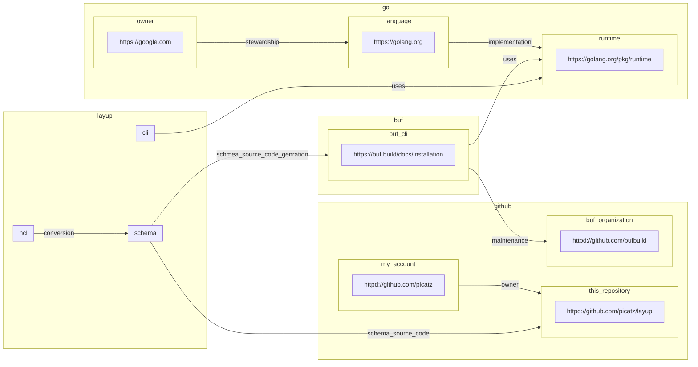

# Layup
 
> [!WARNING]  
> This project is still in the early stages of development and is not ready for production use. That said, it is
> open for contributions and feedback. Please feel free to open an issue or PR if you have any questions or
> suggestions.
>
> It is primarily a personal research project to explore the idea of modeling graph data.

**Layup** enables anyone to model relationships between data in a [graph] using "layers" containing
"nodes" and "links" to represent relationships. It is designed to be a simple, flexible, and
extensible way to model anything. Because everything is a graph.

<!--
## Installation

```console
$ go install -v github.com/picatz/layup/cmd/layup@latest
```

## Usage

```console
$ layup --help
...
```
-->

## HCL Syntax

This projects provides a small [HCL]-based [DSL]. The syntax is designed to be simple and easy for operators to understand and use, especially if they are already familiar with HCL.

It has a few basic components:

* `uri` - a unique identifier declared at the top of the HCL file(s) for the model. Other data is 
          added in layers.
* `layer` - a collection of `node`s and `link`s that represent some data found in a model's graph.
    * `node` - a single node within a layer.
    * `link` - a single link between two nodes, in the same or different layers.

### Example

Lets model a small subset of dependencies of this project in HCL using Layup itself,
and then look at the JSON and Mermaid equivalents:

```hcl
uri = "layup://example"

layer "github" {
    node "my_account" {
        url = "httpd://github.com/picatz"
    }

    node "this_repository" {
        url = "httpd://github.com/picatz/layup"
    }

    node "buf_organization" {
        url = "httpd://github.com/bufbuild"
    }

    link "owner" {
        from = "my_account"
        to = "this_repository"
    }
}

layer "go" {
    node "owner" {
        url = "https://google.com"
    }

    node "language" {
        url = "https://golang.org"
    }

    node "runtime" {
        url = "https://golang.org/pkg/runtime"
    }

    link "stewardship" {
        from = "owner"
        to = "language"
    }

    link "implementation" {
        from = "language"
        to = "runtime"
    }
}

layer "buf" {
    node "cli" {
        url = "https://buf.build/docs/installation"
    }

    link "maintenance" {
        from = "cli"
        to = layer.github.node.buf_organization
    }

    link "uses" {
        from = "cli"
        to = layer.go.node.runtime
    }
}

layer "layup" {
    node "schema" {}

    node "hcl" {}

    node "cli" {}

    link "conversion" {
        from = "hcl"
        to = "schema"
    }

    link "schmea_source_code_genration" {
        from = "schema"
        to = layer.buf.node.cli
    }

    link "schema_source_code" {
        from = "schema"
        to = layer.github.node.this_repository
    }

    link "uses" {
        from = "cli"
        to = layer.go.node.runtime
    }
}
```

> [!NOTE]
> Today, only a single HCL file is supported. This should change in the future to allow for layers
> to exist in their own files.

#### JSON Equivalent

```json
{
  "uri": "layup://example",
  "layers": [
    {
      "id": "github",
      "nodes": [
        {
          "id": "my_account",
          "attributes": {
            "url": "httpd://github.com/picatz"
          }
        },
        {
          "id": "this_repository",
          "attributes": {
            "url": "httpd://github.com/picatz/layup"
          }
        },
        {
          "id": "buf_organization",
          "attributes": {
            "url": "httpd://github.com/bufbuild"
          }
        }
      ],
      "links": [
        {
          "id": "owner",
          "from": "my_account",
          "to": "this_repository"
        }
      ]
    },
    {
      "id": "go",
      "nodes": [
        {
          "id": "owner",
          "attributes": {
            "url": "https://google.com"
          }
        },
        {
          "id": "language",
          "attributes": {
            "url": "https://golang.org"
          }
        },
        {
          "id": "runtime",
          "attributes": {
            "url": "https://golang.org/pkg/runtime"
          }
        }
      ],
      "links": [
        {
          "id": "stewardship",
          "from": "owner",
          "to": "language"
        },
        {
          "id": "implementation",
          "from": "language",
          "to": "runtime"
        }
      ]
    },
    {
      "id": "buf",
      "nodes": [
        {
          "id": "cli",
          "attributes": {
            "url": "https://buf.build/docs/installation"
          }
        }
      ],
      "links": [
        {
          "id": "maintenance",
          "from": "cli",
          "to": "layup://example/layers/github/nodes/buf_organization"
        },
        {
          "id": "uses",
          "from": "cli",
          "to": "layup://example/layers/go/nodes/runtime"
        }
      ]
    },
    {
      "id": "layup",
      "nodes": [
        {
          "id": "schema"
        },
        {
          "id": "hcl"
        },
        {
          "id": "cli"
        }
      ],
      "links": [
        {
          "id": "conversion",
          "from": "hcl",
          "to": "schema"
        },
        {
          "id": "schmea_source_code_genration",
          "from": "schema",
          "to": "layup://example/layers/buf/nodes/cli"
        },
        {
          "id": "schema_source_code",
          "from": "schema",
          "to": "layup://example/layers/github/nodes/this_repository"
        },
        {
          "id": "uses",
          "from": "cli",
          "to": "layup://example/layers/go/nodes/runtime"
        }
      ]
    }
  ]
}
```

#### Mermaid Equivalent



<!-- Links -->

[DSL]: https://en.wikipedia.org/wiki/Domain-specific_language
[HCL]: htttps://github.com/hashicorp/hcl
[graph]: https://en.wikipedia.org/wiki/Graph_(discrete_mathematics)